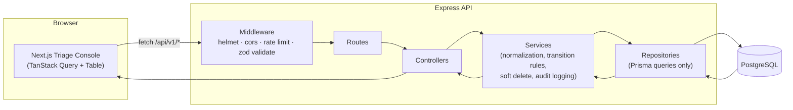
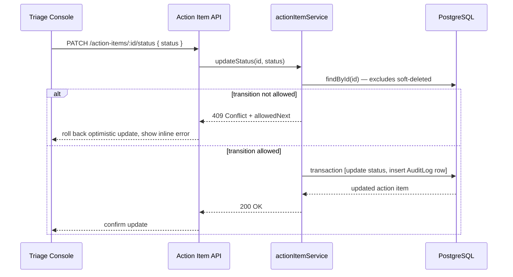
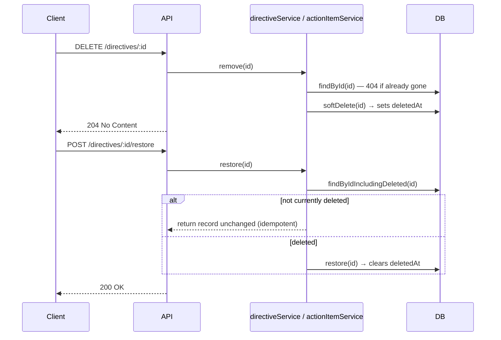
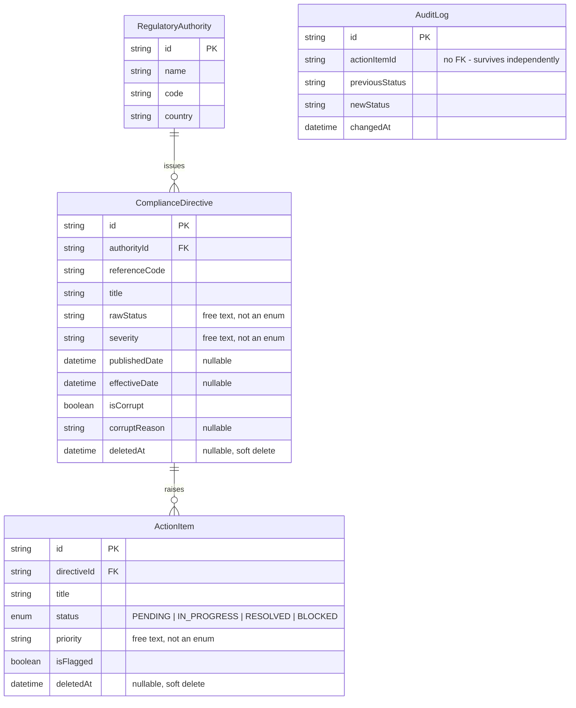

# Architecture

## Request flow

Every request moves in one direction through the backend: a route hands off to a controller,
which calls a service, which calls a repository — the only layer that touches Prisma. Nothing
skips a layer in either direction.

**Why the split matters:** routes wire an HTTP verb + path to a controller and declare which zod
schema validates the request — no logic lives here. Controllers are deliberately thin: pull
params/body, call one service method, shape the response. Services hold every business rule — the
messy-data normalization, the status transition map, the soft-delete/restore logic, and the
decision to write an audit log entry. Repositories are the only files that import the Prisma
client; if Prisma were swapped for another ORM, only this layer would change.

## Status update + audit trail

The status update and its audit log row are written in a single Prisma `$transaction`
(`actionItemRepository.updateStatusWithAudit`) — so the two can never drift apart.

## Soft delete

Every existing `findMany` / `findById` filters `deletedAt: null` automatically, so nothing that
already called those repository methods had to change when soft delete was introduced.

## Data model

`rawStatus`, `severity`, and `priority` are intentionally untyped strings rather than Postgres
enums — see `backend/README.md` for the full reasoning. `ActionItem.status` is the one enum in the
schema, because it's exclusively set through our own API rather than an external feed.
`AuditLog` has no foreign key back to `ActionItem` on purpose — the audit trail should outlive
whatever happens to the item it describes (including a soft delete).