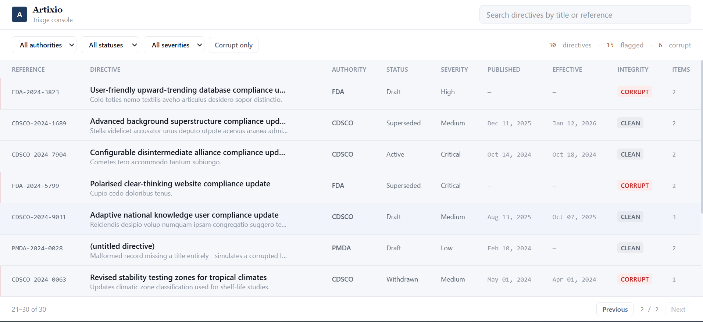
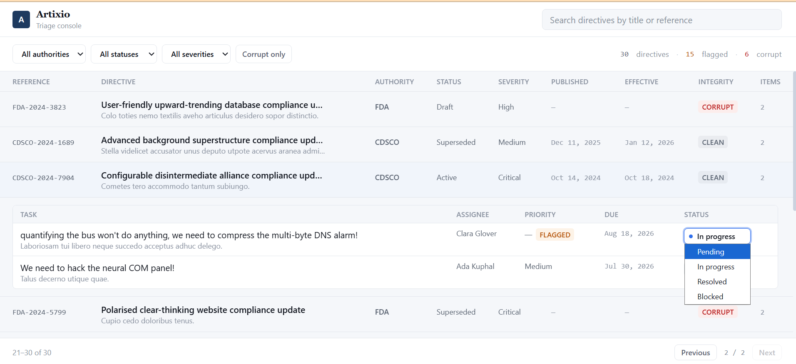
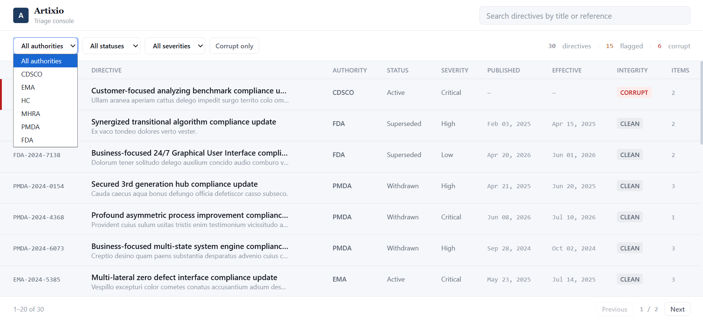

# Artixio — Regulatory Intelligence Triage Pipeline

A full-stack triage console that lets a compliance officer view, filter, and act on simulated
pharmaceutical regulatory directives. The backend's job isn't just to serve data — it's to catch
messy, real-world source data (missing dates, unrecognized status codes, garbage priority values)
and flag it for a human to triage, instead of crashing on it or quietly accepting corrupt records.

## 📸 Application Preview

### Dashboard



### Expanded Action Items



### Corrupt Data Detection



## ✨ Features

- High-density regulatory triage console
- PostgreSQL + Prisma relational data model
- Layered backend architecture (Controller → Service → Repository)
- Corrupt data detection and validation
- Soft Delete support
- Audit logging for Action Item status changes
- TanStack Query with optimistic updates
- Advanced filtering, search, and pagination
- Responsive UI with skeleton loading and retryable error states

> **⏱ This project runs in under 5 minutes.** Follow the steps below in order — no steps skipped,
> nothing improvised — and you'll have the full app running locally.

```

artixio/
│
├── backend/            Node.js + Express + Prisma + PostgreSQL API
├── frontend/           Next.js 14 + Tailwind + TanStack Query/Table
├── docs/
│   ├── screenshots/
│   └── postman/
│
├── ARCHITECTURE.md     diagrams: layered request flow, status-update sequence, ER diagram
└── README.md

```

---

## Run it in under 5 minutes

You need **Node.js 18+** and **PostgreSQL** running locally (via **pgAdmin** or any Postgres
install — instructions below assume pgAdmin, since that's the more common GUI path).

### Step 1 — Create the database in pgAdmin

1. Open **pgAdmin** and connect to your local Postgres server.
2. Right-click **Databases** → **Create** → **Database…**
3. Name it `artixio` → **Save**.

That's it — no tables to create by hand. Prisma builds the schema for you in Step 3.

### Step 2 — Backend

```bash
cd backend
npm install
cp .env.example .env
```

Open `.env` and confirm `DATABASE_URL` matches your pgAdmin connection (same host/port/user/password
you use to log into pgAdmin, database name `artixio`):

```
DATABASE_URL="postgresql://<your_pg_user>:<your_pg_password>@localhost:5432/artixio?schema=public"
```

Then:

```bash
npm run prisma:migrate    # creates every table (including the messy-data flags and audit log)
npm run seed               # seeds authorities, directives, and action items — with intentional edge cases
npm run dev                 # → http://localhost:8000
```

### Step 3 — Frontend

Open a **second terminal**:

```bash
cd frontend
npm install
cp .env.local.example .env.local   # already points at http://localhost:8000/api/v1
npm run dev                         # → http://localhost:3000
```

### Step 4 — Open it

Visit **http://localhost:3000**. You should immediately see a populated triage console — real
seeded directives, some flagged amber, some flagged red, action items ready to be moved through
their workflow.

**If you encounter any issue while running the project, please let me know. The setup was verified on a clean environment before submission. If something doesn't work as described, it's likely an issue on my side rather than with the setup instructions.**

---

## What to look at, if short on time

If you only have two minutes to poke around before the Loom review:

1. Toggle **Corrupt only** in the filter bar → see exactly which seeded records the backend
   flagged, and why (hover the `CORRUPT` badge).
2. Expand any directive row → change an action item's status from **Pending** to **In progress**
   → notice it updates instantly (optimistic UI), then try moving a **Resolved** item back to
   **Pending** to see the backend reject it with the allowed next states.
3. Clear all filters, then set them to something that returns zero rows → see the empty state with
   its **Clear filters** shortcut, rather than a blank table.

## 📬 API Testing

The Postman collection is available at:

```text
docs/postman/Artixio.postman_collection.json
```

Import the collection into Postman and start testing immediately after running the backend.

The collection includes:

- Authorities
- Directives
- Action Items
- Status Update
- Soft Delete
- Restore

## 🎥 Demo

Loom walkthrough:

> _(Link will be added after recording the demo video.)_

---

## Architecture

See [`ARCHITECTURE.md`](./ARCHITECTURE.md) for diagrams of:
- the layered request flow (Route → Controller → Service → Repository → Prisma → PostgreSQL)
- the status-update + audit-log sequence
- the full entity-relationship diagram

## Database schema

```
RegulatoryAuthority (1) ──< ComplianceDirective (1) ──< ActionItem
                                                              ⌐ AuditLog (append-only, by actionItemId)
```

- **RegulatoryAuthority** — the issuing body (FDA, EMA, MHRA, CDSCO, PMDA). Reference data; one
  authority has many directives.
- **ComplianceDirective** — a regulatory update tied to an authority. `rawStatus`, `severity`,
  `publishedDate`, and `effectiveDate` are stored **loosely** (free text / nullable) on purpose —
  this data represents an external feed that cannot be trusted to already match our internal
  vocabulary. Every directive carries `isCorrupt` / `corruptReason`, computed once at write time
  and reused consistently by both the seed script and the live API.
- **ActionItem** — an internal task a compliance officer raises against a directive. `status` is a
  **strict Prisma enum** (`PENDING`, `IN_PROGRESS`, `RESOLVED`, `BLOCKED`) — unlike the directive
  fields, this state comes exclusively from our own API, so there's no external source of truth to
  be messy about. `priority` follows the same loose-and-flagged pattern as the directive fields.
- **AuditLog** — a plain, append-only table recording every action item status change
  (`actionItemId`, `previousStatus`, `newStatus`, `changedAt`), written in the same database
  transaction as the status change itself so the two can never drift apart.

Both `ComplianceDirective` and `ActionItem` also carry a nullable `deletedAt` — this is a
regulatory compliance system, so records are **soft-deleted**, never physically removed. Full
rationale, the delete/restore endpoints, and the index list backing every filter the API runs are
documented in `backend/README.md`.

## Frontend

Single-page triage console, built for someone processing dozens of records a day — not a
dashboard:

- **Dense directive table** (TanStack Table) — reference code, title, authority, status, severity,
  published/effective dates, an integrity badge, and a linked action-item count. Truncated titles
  reveal their full text in a hover tooltip rather than just clipping.
- **Integrity rail** — a colored left-edge bar on every row (gray = clean, amber = flagged, red =
  corrupt), the one visual device the whole UI is built around, so a compliance officer can scan a
  page and immediately spot what needs attention without reading every cell.
- **Filtering** — by authority, status, severity, a corrupt-only toggle, and free-text search, all
  backed by TanStack Query.
- **Row expansion with optimistic status updates** — clicking a directive expands its action items
  inline; changing a status updates the row immediately, and rolls back automatically with an
  inline explanation if the backend rejects the transition or the request fails.
- **Skeleton loading, honest empty states, retry-able errors** — loading shows sized skeleton rows
  (no layout shift once real data lands), a failed request shows a retry button instead of a blank
  screen, and an empty result set distinguishes "no data at all" from "these filters matched
  nothing" with a one-click **Clear filters** button.
- **Fully responsive** — filter bar wraps, table scrolls horizontally on mobile, every interactive
  target stays usable down to phone width.

No fluffy KPI cards — the only summary numbers are a plain-text count of directives, flagged
items, and corrupt items in the filter bar.

## Tech stack

| Layer | Choice |
|---|---|
| Backend | Node.js, Express, TypeScript, Prisma, PostgreSQL, Zod |
| Frontend | Next.js 14 (App Router), TypeScript, Tailwind CSS, TanStack Query, TanStack Table |

## A note on fonts

The UI intentionally uses system font stacks — no Google Fonts or other web-font fetch — so the
build has zero external network dependency beyond `npm install`. Given the 5-minute run
requirement, that was a deliberate choice, not an oversight.